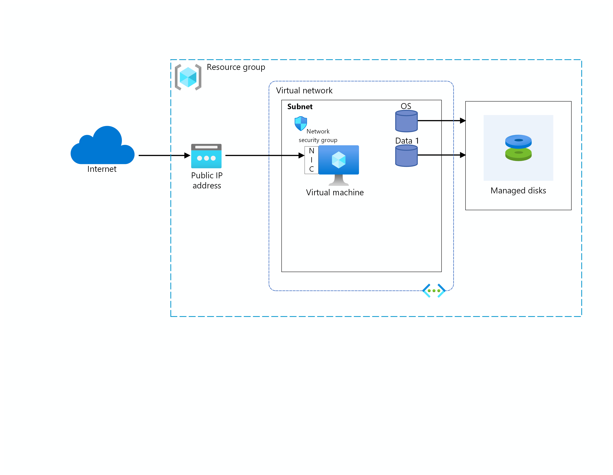

# TerraForm Lab

We can use TerraForm to manage our infrastructure as code. 

## Overview

The script here includes a linux VM, a public IP, a vnet and subnet, and NSG on the public IP. 

## Installation

terraform apply

## Cleanup

terraform destroy

## Usage

terraform fmt => to format the code